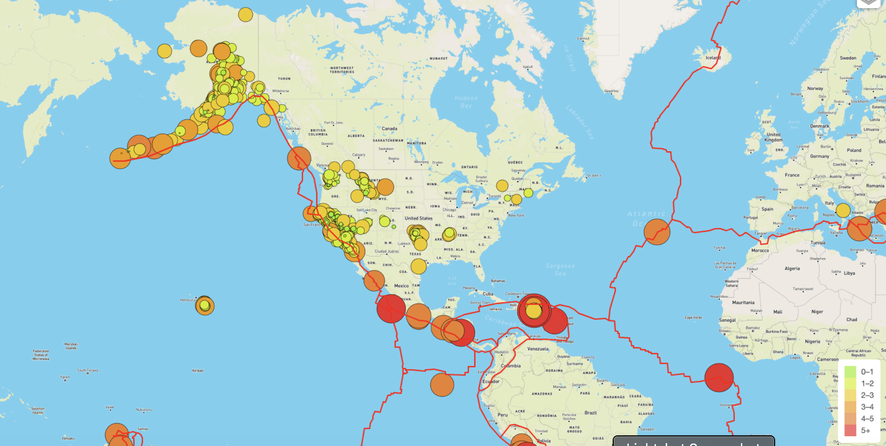

# Overview
Using JavaScript's D3 and Leaflet libraries, the Mapbox API, and geoJSON data (from the USGS website) to create an interactive map that displays earthquake data from the last seven days as well as showing tectonic plate boundaries.

The D3.js library is used to retrieve the coordinates and magnitudes of the earthquakes from the GeoJSON data. The Leaflet library is used to plot the data on a Mapbox map through an API request and create interactivity for the earthquake data.

# Visuals
### These are samples of the interactive map rendered from the Earthquakes folder in the repository.  
The map shows all of the registered earthquakes in the world from the last seven days, with one circle representing a single earthquake. The circles are centered on the epicenter of the earthquake, and are color and size coded by magnitude (see the legend in the bottom left). Each circle has a pop-up marker that displays the location in respect to the nearest city, and the magnitude. 

The red lines visible in the streets map are tectonic plate boundaries.

